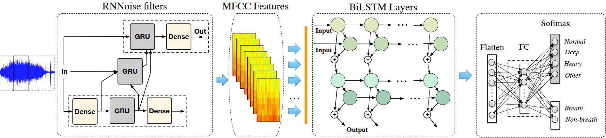

##### Table of Content

1. [Introduction](#introduction)
1. [Dataset](#dataset)
1. [Getting Started](#getting-started)
	- [Requirements](#requirements)
    - [Installation](#installation)
	- [Run training model BiLSTM](#run-training-model-biLSTM)
    - [Run training model SincNet](#run-training-model-sincNet)
1. [Acknowledgement](#acknowledgement)


# Multi-task learning neural networks for breath sound recognition in pervasive healthcare



### Introduction
Respiratory sounds are important indicators of respiratory health and respiratory disorders. The sound emitted when a person breathes is directly related to air movement, changes within lung tissue and the position of secretions within the lung. A wheezing sound, for example, is a common sign that a patient has an obstructive airway disease like asthma or chronic obstructive pulmonary disease (COPD). 

These sounds can be recorded using digital stethoscopes and other recording techniques. This digital data opens up the possibility of using machine learning to automatically diagnose respiratory disorders like asthma, pneumonia and bronchiolitis, to name a few.

### Dataset
The Respiratory Sound Database was created by PTIT research team in Vietnam. It includes 29 annotated recordings of varying length - 60s to 360s. These recordings were taken from many patients at Thai Nguyen Central General Hospital and Thai Nguyen Province Hospital of Tuberculosis and Respiratory Diseases. There are a total of 112.66 minutes of recordings. Breathing sounds include 3 types: 27.24 minutes of normal breathing, 43.31 minutes of deep breathing, 42.11 minutes of strong breathing. The data includes both clean respiratory sounds as well as noisy recordings that simulate real life conditions. The patients span all age groups - children, adults and the elderly.

This dataset includes:

- 29 .wav sound files 

- 29 annotation .txt files

#### General
```
Directory structure:


Each audio file name is divided into 4 elements, separated with underscores (_).
1. Recording index (1,2,...)
2. Sex of the patient
3. Age of the patient
4. Patient's name

The annotation text files have 3 columns:
- Start time(s)
- End time(s)
- Status

```

### Getting Started

##### Requirements

- python=3.7
- tensorflow-gpu

##### Installation

```sh
conda create -n breath-env -y python=3.7
conda activate breath-env
conda install -y tensorflow-gpu
```

##### Run training model BiLSTM: 
```sh
python3 training_main_lstm.py
```

##### Run training model SincNet: 
1. Go to [Google Colab](https://colab.research.google.com) and sign in!

2. Go to the "*GitHub*" tab and type "*Multitask-Breath-Sound*"

3. Pick a notebook in "*Breath-Code/notebooks*" and run it!

### Acknowledgement
Model Multitask SincNet is built based-on [SincNet](https://github.com/mravanelli/SincNet)
